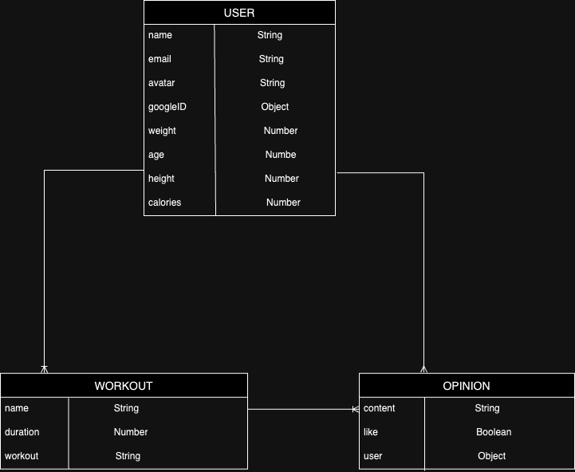
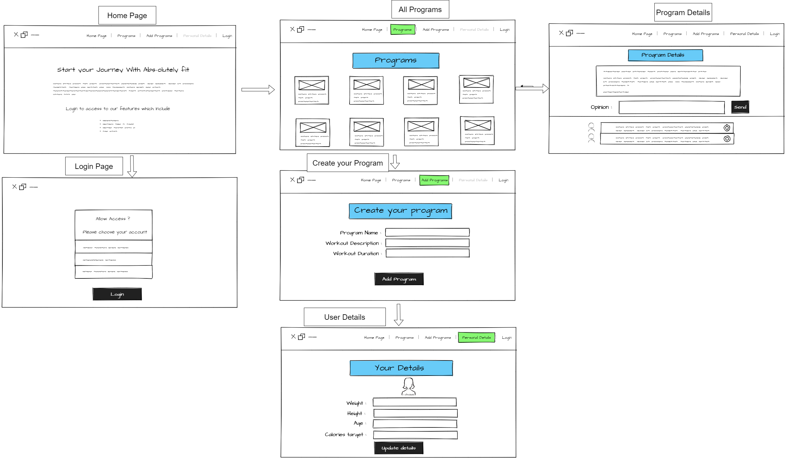

# Abs-Olute

## 08/02/2024

### By: Ali Elsayed, AAmir Saleh, Nayef Alzayani

[Linkedin](https://www.linkedin.com/in/nayefalzayani) | [GitHub](https://github.com/nakz57)

---

#### **_Description_**

Abs-Olute!!! Is a community type website where people come in together to either create or find workouts!! The website requires you to log in to access its facility like creating, adding and interacting with workouts whether it was your or fellow Abs-oluters. Thats not all, you can also add your personal information to keep track of your athletic progress.

#### **_Technologies_**

- Javascript
- HTML
- CSS
- Express
- OAuth

#### **_Screenshot_**

This is the Entity Relation Diagram (ERD) for this project showing the relation between the User, Program, and Opinion

This is an image of the wireframe of the project, so far the basic layout would consist of 6 pages, each one taking one to another.

#### **_Tasks_**

- [x] Create a Story
- [x] Finish up Trello
- [ ] Divide Tasks
- [ ] Create the main files for the repository

#### **_Credits_**
