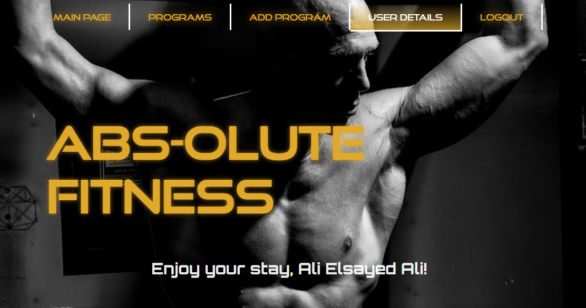
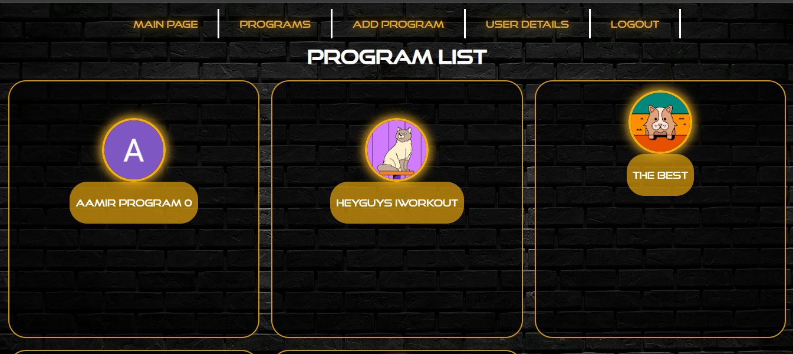
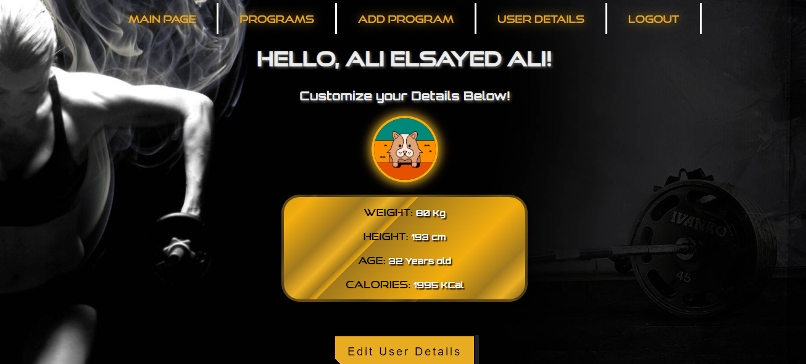

# Abs-Olute

## 08/02/2024
### Created By:
### Ali Elsayed
[Linkedin](https://www.linkedin.com/in/ali-elamir/) | [GitHub](https://github.com/AliElamir)

### Nayef Alzayani
[Linkedin](https://www.linkedin.com/in/nayefalzayani) | [GitHub](https://github.com/nakz57)

### AAmir Saleh
---

#### **_Description_**

Abs-Olute!!! Is a community type website where people come in together to either create or find workouts!! The website requires you to log in to access its facility like creating, adding and interacting with workouts whether it was your or fellow Abs-oluters. Thats not all, you can also add your personal information to keep track of your athletic progress.

#### **_Technologies_**

- Javascript
- HTML
- CSS
- Express
- OAuth
- VS Code

#### **_Screenshot_**

This is the Entity Relation Diagram (ERD) for this project showing the relation between the User, Program, and Opinion

This is an image of the wireframe of the project, so far the basic layout would consist of 6 pages, each one taking one to another.

following from the the previous wireframe, the following image shows the main page of the Abs-oulte webpage, which consist of the title of the webpage and welcome message to the user that is using the website.
There are several navigation the user can use, which will lead the user to a different page depending on their use.

Moving on to the second image which demonstrates different programs a user can choose from that were produced from other users, and when a user hovers on any of the programs that listed on the page it will show the user the title of the program and the duration of the program, that it will take to complete said workout.

The final preview of this website, would be the user details, where the user can put his/her details to keep track of their own personal record, and for this page, there will be more updates to come!!

#### **_Launch the Website_**
In this section you will find a link to use the Abs-olute website, and if you press on this [Abs-olute](https://abs-olute.fly.dev/), you would be able to experince this app for yourself.

Right here you would be able to see the the Trello board that was used when desiging the app and you can reach that by click this [Trello]()

#### **_Future Features_**
As any application, there is always room for improvement, for Abs-oulte, these would be in its features, there would be an improvement in the user page, where it would make certain calculations for the user, keep a better track of weight loss or gain, adding a like feature to a program so users which programs are more popular and that are useful, and then a search bar that would help users find a certain program they want to use instead of going over all the programs.

#### **_Credits_**
- W3Schools
- UIVerse 
- Stackoverflow 
